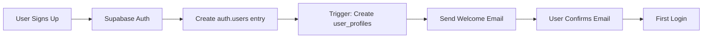
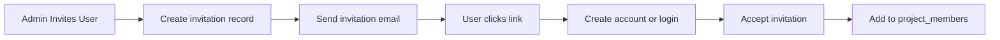
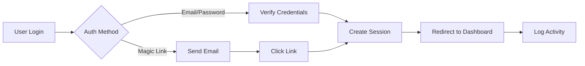

# User Authentication Setup Guide

This guide explains how to set up user authentication with Supabase Auth for the Aloa Project Manager.

## Overview

The authentication system provides:
- Email/password authentication
- Magic link authentication
- Role-based access control (RBAC)
- User invitation system
- Activity logging and audit trail

## User Roles

### Global Roles
1. **super_admin** - Aloa team members who can manage all projects
2. **project_admin** - Users who can create and manage their own projects
3. **team_member** - Internal team members with limited admin access
4. **client** - External stakeholders who view and interact with projects

### Project-Specific Roles
1. **owner** - Full control over the project
2. **admin** - Can manage project settings and team
3. **editor** - Can edit project content
4. **viewer** - Read-only access

## Setup Instructions

### Step 1: Enable Supabase Auth

1. Go to your Supabase Dashboard
2. Navigate to **Authentication** → **Settings**
3. Configure the following:
   - Enable Email Auth
   - Set up email templates
   - Configure redirect URLs:
     ```
     http://localhost:3000/auth/callback
     https://your-domain.com/auth/callback
     ```

### Step 2: Run Database Migrations

Execute the SQL files in order:
```sql
-- Run in Supabase SQL Editor
-- 1. Create user tables and roles
supabase/01_create_users_and_roles.sql
```

### Step 3: Configure Environment Variables

Add to your `.env.local`:
```env
# Existing variables
NEXT_PUBLIC_SUPABASE_URL=your-project-url
NEXT_PUBLIC_SUPABASE_ANON_KEY=your-anon-key

# Add these for auth
SUPABASE_SERVICE_ROLE_KEY=your-service-role-key
NEXT_PUBLIC_APP_URL=http://localhost:3000
```

### Step 4: Install Required Packages

```bash
npm install @supabase/auth-helpers-nextjs @supabase/auth-ui-react @supabase/auth-ui-shared
```

## Authentication Flow

### 1. New User Registration


### 2. User Invitation Flow


### 3. Login Flow


## API Integration

### Protected API Routes
All API routes should check authentication:

```javascript
// api/protected-route.js
import { createServerComponentClient } from '@supabase/auth-helpers-nextjs';
import { cookies } from 'next/headers';

export async function GET(request) {
  const supabase = createServerComponentClient({ cookies });
  
  const { data: { user }, error } = await supabase.auth.getUser();
  
  if (!user) {
    return Response.json({ error: 'Unauthorized' }, { status: 401 });
  }
  
  // Check user role
  const { data: profile } = await supabase
    .from('user_profiles')
    .select('*')
    .eq('id', user.id)
    .single();
  
  // Your protected logic here
}
```

### Role-Based Access Control
```javascript
// Check if user has required role
async function hasRole(userId, requiredRole) {
  const { data: profile } = await supabase
    .from('user_profiles')
    .select('role')
    .eq('id', userId)
    .single();
  
  return profile?.role === requiredRole;
}

// Check project-specific permissions
async function hasProjectPermission(userId, projectId, permission) {
  const { data: member } = await supabase
    .from('project_members')
    .select('*')
    .eq('user_id', userId)
    .eq('project_id', projectId)
    .single();
  
  return member?.[permission] === true;
}
```

## User Management Features

### 1. User Profile Management
- Users can update their profile information
- Upload avatar images
- Set notification preferences
- Manage account settings

### 2. Team Management
- Project admins can invite team members
- Assign project-specific roles
- Remove team members
- View team activity

### 3. Activity Logging
All important actions are logged:
- Login/logout events
- Form submissions
- File uploads/downloads
- Project modifications
- Team changes

### 4. User Dashboard Features
- View assigned projects
- Track pending tasks
- Access recent activity
- Manage notifications

## Security Best Practices

1. **Always verify authentication server-side**
   - Don't trust client-side auth state for sensitive operations
   - Verify JWT tokens on every API request

2. **Use Row Level Security (RLS)**
   - All tables have RLS enabled
   - Policies restrict data access based on user role

3. **Implement rate limiting**
   - Limit login attempts
   - Throttle API requests
   - Prevent brute force attacks

4. **Secure invitation tokens**
   - Use cryptographically secure random tokens
   - Set expiration times
   - One-time use only

5. **Log security events**
   - Failed login attempts
   - Permission denied events
   - Suspicious activity patterns

## Migration from Current System

### Linking Existing Data
The current system uses localStorage-based user IDs. To migrate:

1. **Create accounts for existing users**
   - Import user emails from stakeholders
   - Send invitation emails

2. **Link existing responses**
   - Map old user_id to new authenticated_user_id
   - Preserve historical data

3. **Update client dashboard**
   - Replace localStorage logic with auth
   - Maintain backward compatibility

### Data Migration Script
```sql
-- Link existing responses to authenticated users
UPDATE aloa_responses r
SET authenticated_user_id = up.id
FROM user_profiles up
WHERE r.respondent_email = up.email
AND r.authenticated_user_id IS NULL;

-- Link existing file uploads
UPDATE project_files pf
SET uploaded_by_user_id = up.id
FROM user_profiles up
WHERE pf.uploaded_by = up.email
AND pf.uploaded_by_user_id IS NULL;
```

## Testing

### Test Accounts
Create test accounts for each role:
- super_admin@test.com
- project_admin@test.com
- team_member@test.com
- client@test.com

### Test Scenarios
1. User registration and email confirmation
2. Login with email/password
3. Magic link authentication
4. Password reset flow
5. User invitation and acceptance
6. Role-based access restrictions
7. Activity logging
8. Session management

## Troubleshooting

### Common Issues

1. **"User not found" error**
   - Check if user_profiles was created
   - Verify trigger is working

2. **"Permission denied" errors**
   - Check RLS policies
   - Verify user role

3. **Email not sending**
   - Configure SMTP settings in Supabase
   - Check email templates

4. **Session expires too quickly**
   - Adjust JWT expiry in Supabase settings
   - Implement refresh token logic

## Next Steps

1. Implement authentication UI components
2. Add middleware for protected routes
3. Create user management dashboard
4. Set up email templates
5. Implement activity dashboard
6. Add two-factor authentication (optional)